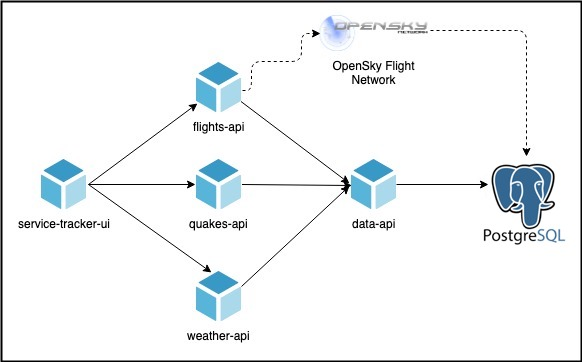
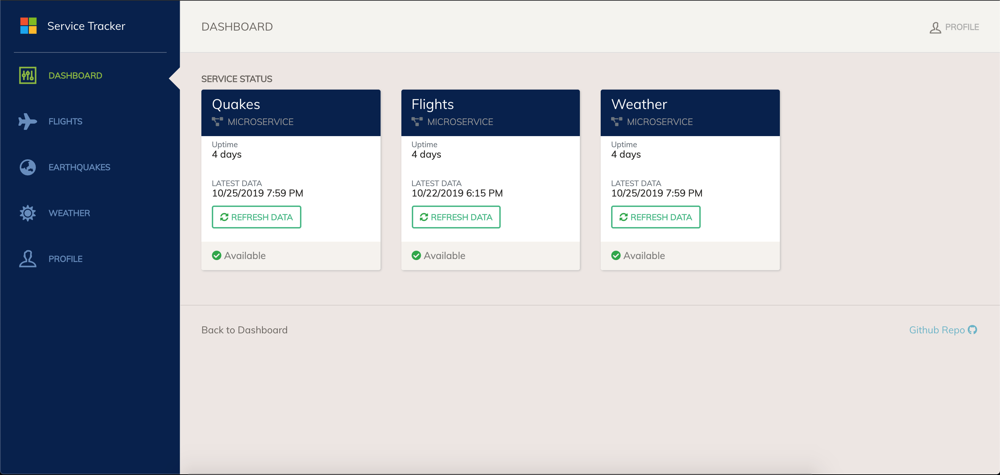

## Service Tracker Example

This is an example microservices application with a Javascript Web UI, a Postgres database, and a series of API microservices. The idea is that various app developers would create Components for their corresponding apps. The overall config will add traits and allow the app to be fully deployed.
The application being deployed is shown in the following diagram:



> Full application original source here: https://github.com/chzbrgr71/service-tracker

In this example, there are various roles that handle each aspect of the OAM application.

* UI Developer
* API Microservices Developer
* Postgres Admin
* App Operator / SRE (handles application deployment in Kubernetes)

## Quickstart: Deploy the sample to Rudr running on any Kubernetes cluster

### Pre-requisites for this sample

* [Install Helm 3](https://github.com/oam-dev/rudr/blob/master/docs/setup/install.md#prerequisites)
* [Install kubectl](https://github.com/oam-dev/rudr/blob/master/docs/setup/install.md#prerequisites)
* A running Kubernetes cluster.

### Infrastructure Operator:  Install Rudr and an Ingress controller

As an infrastructure operator, I choose to set up the Kubernetes cluster with Rudr and NGINX as the Ingress controller.

* [Install Rudr](https://github.com/oam-dev/rudr/blob/master/docs/setup/install.md#installing-rudr-using-helm-3) on your cluster.
* [Install the NGINX Controller](https://github.com/oam-dev/rudr/blob/master/docs/setup/install.md#ingress) on your cluster.

### Application Developer: Authoring and registering component schematics

There is one UI microservice, four API microservices and one Postgres DB admin. Each team is responsible for delivering the component schematic for their microservice.

1. The **OAM Component Schematics** that are applied require the following information about the app from the developers:

* The workloadType which dictates how the microservice is supposed to run. In this example, all are of type `Server` indicating multiple replicas can exist.
* The container image and credentials. Developers are responsible at the very least for authoring the Dockerfiles containing the dependencies in order to build their runnable container. This example also expects an image to be pushed to a registry although this can be handled by a continuous integration system.
* Container ports that expose any ports that servers are listening to.
* Parameters that can be overriden by an operator at time of instiation

2. Register the `ComponentSchematics`.

    ```
    kubectl apply -f tracker-db-component.yaml
    kubectl apply -f tracker-data-component.yaml
    kubectl apply -f tracker-flights-component.yaml
    kubectl apply -f tracker-quakes-component.yaml
    kubectl apply -f tracker-weather-component.yaml
    kubectl apply -f tracker-ui-component.yaml
    ```

    #### ***A look inside***
    The command registers the API microservices, UI as OAM components available to Rudr. At this point, nothing is running but the components are available for instantiation by the operator.

### Application Operator: Instantiate application with appropriate configuration

The application operator (this may or may not be different than the developer) tasks involve running the application with appropriate configurations.

1. This **OAM ApplicationConfiguration** instantiates each of the components and allows the operator to tune the following when running the components:

* Number of replicas for each component
* Ingress properties such as hostname, routing rules, exposed port. The implementation of the Ingress (in this case NGINX) is not of concern
* Values for any parameters that can be overriden in the components.

2. Install the `ApplicationConfiguration`.

    ```
    kubectl create -f tracker-app-config.yaml
    ```

    #### ***A look inside***

    With Rudr, applying an OAM `ApplicationConfiguration` takes care of the following in Kubernetes for the user:

    * Starting pods
    * Instantiating Services with appropriate configurations
    * Creates the Ingress resource with the rules

    The OAM specification allows developers to describe their application and Rudr takes care of translating and managing the OAM specification into Kubernetes definitions.

3. Run `kubectl get svc` to obtain the external IP to the NGINX controller. It will look like the below.

    ```bash
    nginx-ingress-controller        LoadBalancer   10.0.253.208   13.64.241.76   80:32751/TCP,443:30402/TCP   28h
    ```

4. Add the following to your `/etc/hosts` file so you can access the endpoint using the host (servicetracker.oam.io).

    ```
    13.64.241.76 servicetracker.oam.io
    ```

5. Visit your browser and type in `servicetracker.oam.io` for the Service Tracker website. Refresh the data on the dashboard for each of the microservices.

    

6. Once the data is refreshed, hitting the **Flights**, **Earthquakes** or **Weather** tabs on the left, will provide up-to-date information.

    
