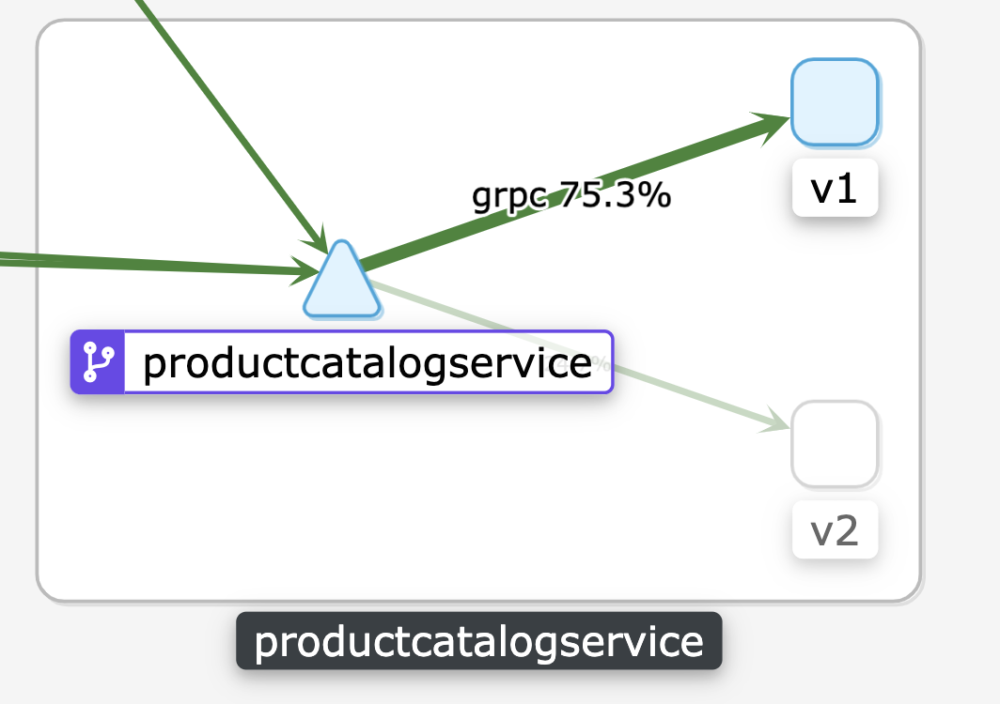

# GoogleCloudPlatform-MicroServices-Demo with Kubevela

[MicroServices-Demo](https://github.com/GoogleCloudPlatform/microservices-demo) is a cloud-native microservices demo application.
This Demo create a **Online Boutique** application. **Online Boutique** consists of a 10-tier microservices application. 
The application is a web-based e-commerce app where users can browse items, add them to the cart, and purchase them. 
In this example, we will deploy the demo in the local k8s cluster **kind**. 

## Prerequisites
* istio 1.6+
  
  Pleaser refer to [Download and Install Istio](https://istio.io/latest/docs/setup/getting-started/).


## Deploy Application

Application **boutique** is composed of 11 microservices and 1 worker. microservices provide shopping services, the worker(Load Generator) continuously sends requests imitating realistic user shopping flows to the frontend.


### Apply WorkloadDefinition
In this demo, we abstracted out 2 types of workload: [microservice](./Definitions/workloads/microservice.yaml) and [enhanced-worker](./Definitions/workloads/enhanced-worker.yaml).

1. microservice: microservice describe a workload component Deployment with Service.
2. enhanced-worker: enhanced-worker describe a long-running, scalable, containerized services that running at backend. They do NOT have network endpoint to receive external network traffic.

We register these workloads to Kubevela.

```shell
kubectl apply -f Definitions/workloads
```

### Apply TraitDefinition

We have defined following 7 traits to operate these workloads.

1. [patch-annotations](./Definitions/traits/patch-annotations.yaml): patch-annotations can patch the annotation informations to the Deployment. In this demo, microservice **Frontend** and **Cache(redis)** use the [resource annotations](https://istio.io/latest/docs/reference/config/annotations/) that Istio supports to control its behavior.
2. [patch-loadbalancer](./Definitions/traits/patch-loadbalancer.yaml): patch-loadbalancer can create a type=LoadBalancer Service for microservice workload to allow outside access.
3. [patch-cmd-probe](./Definitions/traits/patch-cmd-probe.yaml): patch-cmd-probe can add a probe to detect the service status by executing command.
4. [patch-http-probe](./Definitions/traits/patch-http-probe.yaml): patch-http-probe can add a probe to detect the service status by sending HTTP Request.
5. [patch-tcp-probe](./Definitions/traits/patch-tcp-probe.yaml): patch-tcp-probe can add a probe to detect the pod status by establishing a socket connection.
6. [patch-resources-limits](./Definitions/traits/patch-resources-limits.yaml): this trait can patch resources limits.
7. [patch-volume](./Definitions/traits/patch-volume.yaml): patch-volume can mount empty volumes to container.

We register these traits to Kubevela.

```shell
kubectl apply -f Definitions/traits
```

### Apply Application 

```shell
kubectl apply -f App/online-boutique-v1.yaml
```

Wait until the Appliaction status is `running`.

```yaml
$ kubectl get application boutique -o yaml
apiVersion: core.oam.dev/v1alpha2
kind: Application
metadata:
  ...
  name: boutique
  namespace: default
spec:
  components:
  - name: frontend
    ...
    traits:
    - name: patch-annotations
      properties:
        annotations:
          sidecar.istio.io/rewriteAppHTTPProbers: "true"
    ...
status:
  ...
  latestRevision:
    name: boutique-v1
    revision: 1
    revisionHash: a67282a0f1428730
  ...
  status: running
```

In the K8s cluster, you will see the following resources are created:

```shell
$ kubectl get deployment
NAME                       READY   UP-TO-DATE   AVAILABLE   AGE
adservice-v1               1/1     1            1           118s
cartservice-v1             1/1     1            1           119s
checkoutservice-v1         1/1     1            1           118s
currencyservice-v1         1/1     1            1           119s
emailservice-v1            1/1     1            1           118s
frontend-v1                1/1     1            1           119s
loadgenerator-v1           1/1     1            1           118s
paymentservice-v1          1/1     1            1           118s
productcatalogservice-v1   1/1     1            1           119s
recommendationservice-v1   1/1     1            1           118s
redis-cart-v1              1/1     1            1           117s
shippingservice-v1         1/1     1            1           118s

$ kubectl get service
NAME                    TYPE           CLUSTER-IP      EXTERNAL-IP   PORT(S)        AGE
adservice               ClusterIP      <your ip>       <none>        9555/TCP       2m40s
cartservice             ClusterIP      <your ip>       <none>        7070/TCP       2m41s
checkoutservice         ClusterIP      <your ip>       <none>        5050/TCP       2m40s
currencyservice         ClusterIP      <your ip>       <none>        7000/TCP       2m40s
emailservice            ClusterIP      <your ip>       <none>        5000/TCP       2m40s
frontend                ClusterIP      <your ip>       <none>        80/TCP         2m41s
frontend-external       LoadBalancer   <your ip>       <pending>     80:31927/TCP   2m41s
paymentservice          ClusterIP      <your ip>       <none>        50051/TCP      2m40s
productcatalogservice   ClusterIP      <your ip>       <none>        3550/TCP       2m41s
recommendationservice   ClusterIP      <your ip>       <none>        8080/TCP       2m40s
redis-cart              ClusterIP      <your ip>       <none>        6379/TCP       2m39s
shippingservice         ClusterIP      <your ip>       <none>        50051/TCP      2m40s
```

### Access the web frontend in a browser

The microservice **Fronted** expose a service(LoadBalacer) to allow outside access.

```shell
$ kubectl get service frontend-external
NAME                TYPE           CLUSTER-IP      EXTERNAL-IP   PORT(S)        AGE
frontend-external   LoadBalancer   <your ip>       <pending>     80:31420/TCP   66s
```
Although kind does not support type=LoadBalancer currently but we can still access the fronted from local.

```shell
kubectl port-forward svc/frontend 8000:80
```

Then you can access **Online Boutique** through [http://127.0.0.1:8000/](http://127.0.0.1:8000/).


## Use istio for traffic management

### Create istio gateway and virtualservice

```shell
kubectl apply -f istio-manifests.yaml
```

### Access the web from istio gateway

```shell
$ kubectl get svc/istio-ingressgateway -n istio-system
NAME                   TYPE           CLUSTER-IP      EXTERNAL-IP   PORT(S)                                                                      AGE
istio-ingressgateway   LoadBalancer   <your ip>       <pending>     15021:30077/TCP,80:31791/TCP,443:32113/TCP,31400:31457/TCP,15443:32035/TCP   12m
```

We do port forwarding to the ingressgateway of istio.

```shell
kubectl port-forward svc/istio-ingressgateway -n istio-system 8080:80
```
Then you can access the **Online Boutique** from [http://127.0.0.1:8080/](http://127.0.0.1:8080/).


### Traffic Management
In this section, we show the istio's traffic management capabilities. 

1. Deploy ProductCatalog v2.
```shell
kubectl apply -f App/online-boutique-v2.yaml
```

Using kubectl get deployment, verify that the v2 deployment is Running.
```shell
$ kubectl get deployment
NAME                       READY   UP-TO-DATE   AVAILABLE   AGE
productcatalogservice-v1   1/1     1            1           5m23s
productcatalogservice-v2   1/1     1            1           33s
```

2. Create an Istio DestinationRule for productcatalogservice.
```shell
kubectl apply -f istio-canary/destinationrule.yaml
```

3. Create an Istio VirtualService to split incoming productcatalog traffic between v1 (75%) and v2 (25%).

```shell
kubectl apply -f istio-canary/vs-split-traffic.yaml
```

4. Open [http://127.0.0.1:8080/](http://127.0.0.1:8080/) in web browser, access again to the **Online Boutique**, productcatalogservice-v2 introduces a 3-second latency into all server requests. So refresh the homepage a few times. You should notice that periodically, the frontend is slower to load.

5. View traffic splitting in Kiali, this step you need install [Kiali](https://istio.io/latest/docs/setup/getting-started/#dashboard).

```
istioctl dashboard kiali
```
Open the Kiali dashboard. Please navigate to Service Graph > namespace: default and select "Versioned App Graph."You should see that approximately 75% of productcatalog requests are going to v1.



6. Return 100% of productcatalog traffic to v1:
```
kubectl apply -f istio-canary/rollback.yaml
```

## Clean up
```shell
$ kubectl delete -R --ignore-not-found -f .
application.core.oam.dev "boutique" deleted
traitdefinition.core.oam.dev "patch-annotations" deleted
traitdefinition.core.oam.dev "patch-cmd-probe" deleted
traitdefinition.core.oam.dev "patch-http-probe" deleted
traitdefinition.core.oam.dev "patch-loadbalancer" deleted
traitdefinition.core.oam.dev "patch-resources-limits" deleted
traitdefinition.core.oam.dev "patch-tcp-probe" deleted
traitdefinition.core.oam.dev "patch-volume" deleted
workloaddefinition.core.oam.dev "enhanced-worker" deleted
workloaddefinition.core.oam.dev "microservice" deleted
destinationrule.networking.istio.io "productcatalogservice" deleted
virtualservice.networking.istio.io "productcatalogservice" deleted
gateway.networking.istio.io "frontend-gateway" deleted
virtualservice.networking.istio.io "frontend-ingress" deleted
virtualservice.networking.istio.io "frontend" deleted
```
